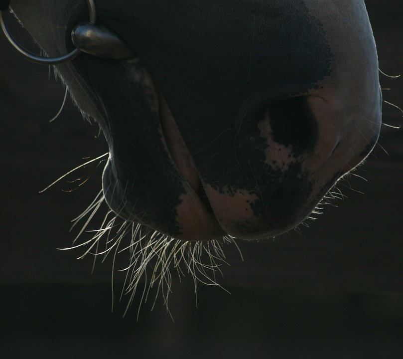

### Time to Complete
7 min

## Prerequisites  
 - **Proficiency:** Advanced
 - **Tutorials:** [Configuring Eclipse with SAP HANA Cloud Platform Tools for Java](https://github.com/mamosova/tutorials/edit/master/tutorials/test1111/accardion.md)

## Next Steps
 - Select a tutorial from the [Tutorial Navigator new](http://go.sap.com/developer/tutorial-navigator.html) or the [Tutorial Catalog](http://go.sap.com/developer/tutorials.html)

## Details
### You will learn  
- In this tutorial you will create a Dynamic Web project, a servlet to respond to a browser request and after running it in your local development environm343ent, deploy it to SAP HANA Cloud Platform.
- In this tutorial you will create a Dynamic Web project, a servlet to respond to a browser request and after running it in your local development environm343ent, deploy it to SAP HANA Cloud Platform.
- In this tutorial you will create a Dynamic Web project, a servlet to respond to a browser request and after running it in your local development environm343ent, deploy it to SAP HANA Cloud Platform.

---

**Image with *jpg format**

   
   
   
   **Image with *png format**

   
   
   
   **Image with spaces between words (jpg format)**

    
   
   
   **Image with spaces between words (png format)**

   
   
   
   **Image with indicating the way. Example: tutorials/images/image.jpg (jpg format)**
   
   
   
   
   **Image with indicating the way. Example: tutorials/images/image.png (png format)**
   
   
   
   
   **Image with indicating the way and spaces between words. Example: tutorials/images/image test.jpg (jpg format)**
   
   
   
   
   **Image with indicating the way and spaces between words. Example: tutorials/images/image test.png (png format)**
    
   
   
   
   **Image from another folder. Example: with_Image/image.jpg (jpg format)**
   
   
   
   
   **Image from another folder. Example: with_Image/image.png (png format)**
   
   
   
   
   **Image from another folderS. Example: folder_with_images/inner_folder/image.jpg (jpg format)**
   
   
   
   
   **Image from another folderS. Example: folder_with_images/inner_folder/image.png (png format)**
   
   
   
   
  [ACCORDION-BEGIN [STEP 1](Image with  *JPG format (jpg format))]
   
   
   [ACCORDION-END]
   
   
     [ACCORDION-BEGIN [STEP 2](Image with  *PNG format (png format))]

     
     [ACCORDION-END]
   

     [ACCORDION-BEGIN [STEP 3](Image with *jpg format)]

   
   [ACCORDION-END]
   
   
  [ACCORDION-BEGIN [STEP 4](Image with *png format)]

   
   [ACCORDION-END]
   
   
     [ACCORDION-BEGIN [STEP 5](Image with spaces between words (jpg format))]

       
   [ACCORDION-END]
   
   
   [ACCORDION-BEGIN [STEP 6](Image with spaces between words (png format))]

     
   [ACCORDION-END]
   
   
   [ACCORDION-BEGIN [STEP 7](Image with indicating the way. Example: tutorials/images/image.jpg (jpg format))]
     
   
   [ACCORDION-END]
   
   
      [ACCORDION-BEGIN [STEP 8](Image with indicating the way. Example: tutorials/images/image.png (png format))]

     
   [ACCORDION-END]
   
   
      [ACCORDION-BEGIN [STEP 9](Image with indicating the way and spaces between words. Example: tutorials/images/image test.jpg (jpg format))]

     
   [ACCORDION-END]
   
   
      [ACCORDION-BEGIN [STEP 10](Image with indicating the way and spaces between words. Example: tutorials/images/image test.png (png format))]

   
   [ACCORDION-END]
   
   
    [ACCORDION-BEGIN [STEP 11](Image from another folder. Example: with_Image/image.jpg (jpg format))]   
   
   
   [ACCORDION-END]
   
   
   [ACCORDION-BEGIN [STEP 12](Image from another folder. Example: with_Image/image.png (png format))]   
   
   
   [ACCORDION-END]
   
   
   [ACCORDION-BEGIN [STEP 13](Image from another folderS. Example: folder_with_images/inner_folder/image.jpg (jpg format))]   

   
   [ACCORDION-END]
   
   
   [ACCORDION-BEGIN [STEP 14](Image from another folderS. Example: folder_with_images/inner_folder/image.png (png format))]   

  
   [ACCORDION-END]
   
   
   [ACCORDION-BEGIN [STEP 15](Image with  *JPG format (jpg format))]   

   
   [ACCORDION-END]
   
   
   [ACCORDION-BEGIN [STEP 16](Image with  *PNG format (png format))]   

   
   [ACCORDION-END]
UPDATE
